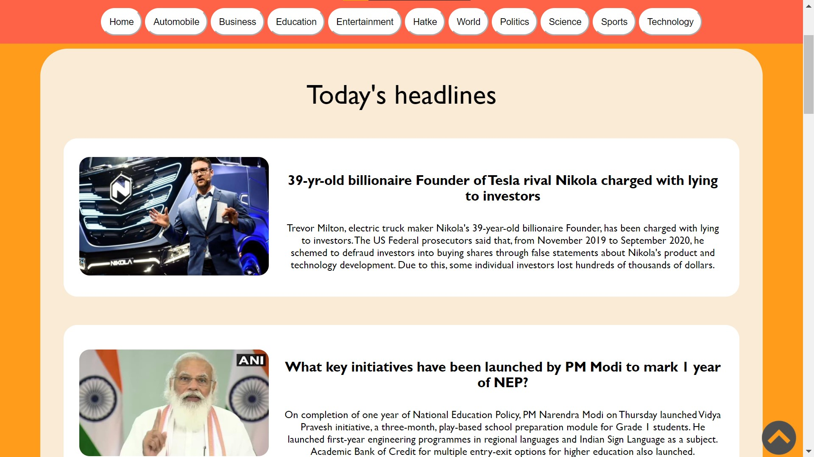
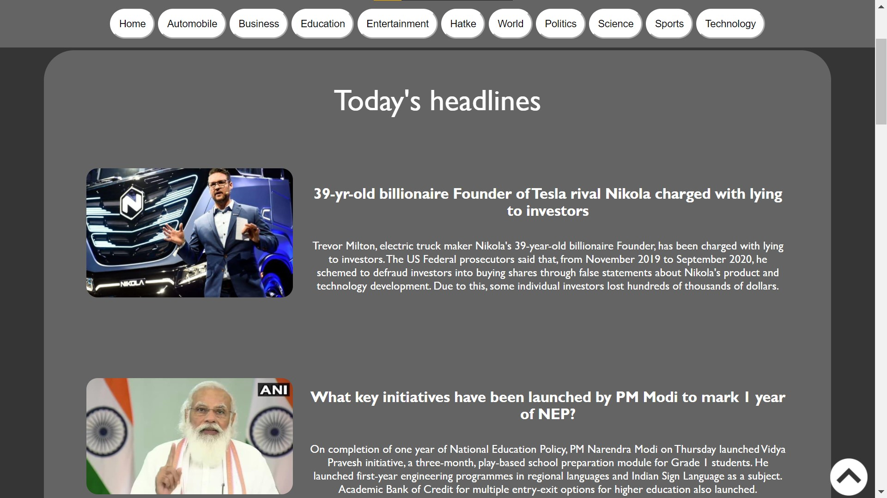

# Oberver

A website which displays live and updated news

This is made with Inshorts News API v2

This API's documentation [here](https://github.com/sumitkolhe/inshorts-api-v2)

Visit the website [here](https://vinayak5002.github.io/Observer/home.html)

And this is how my website looks:

Home page in light mode

Home page in dark mode

News in light mode

News in dark mode

